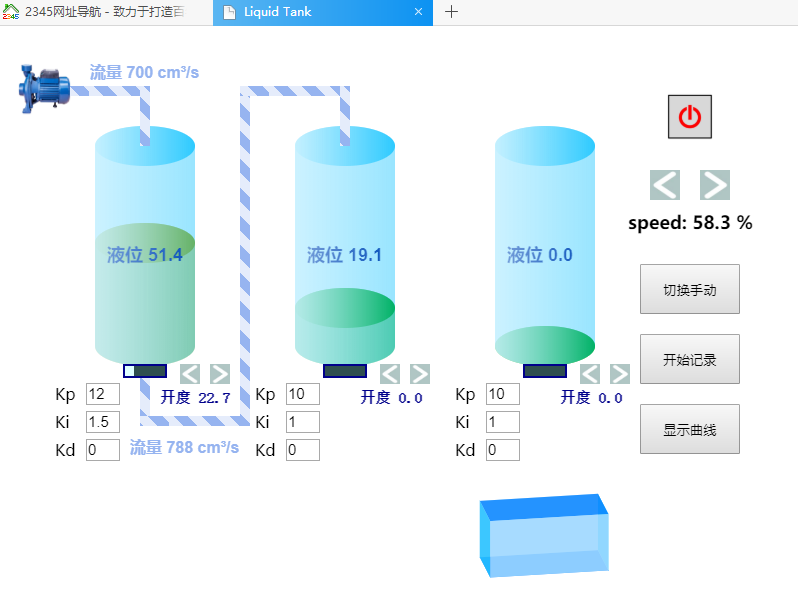
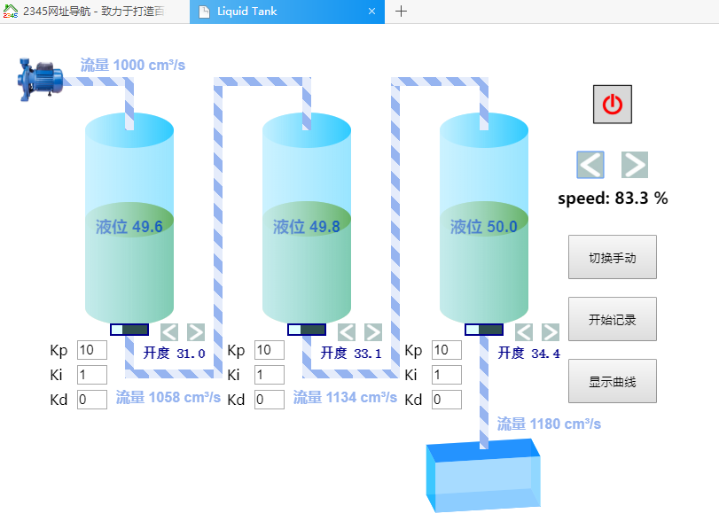
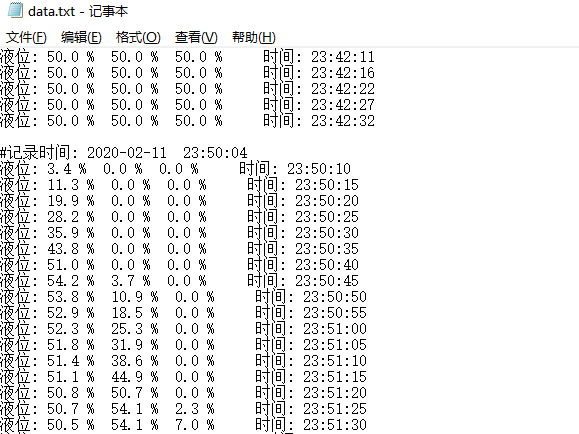
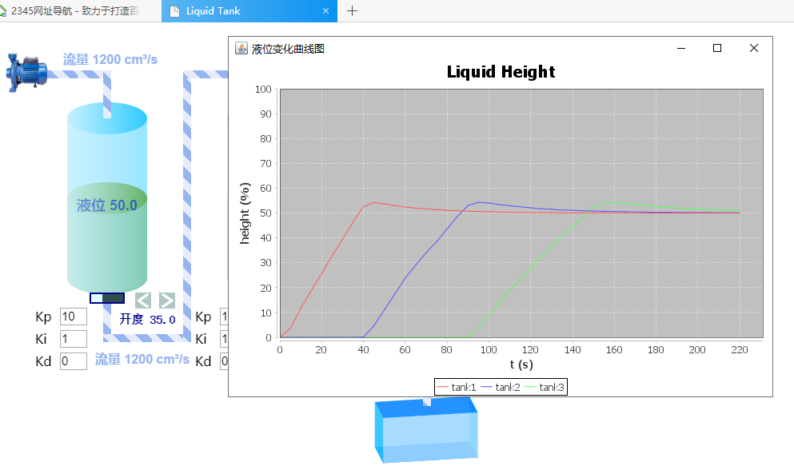

# web_liquid_tank
### Simulation web page of three-level liquid processing tank through PID control
### 三级原液处理罐液位PID控制模拟网页

#### 利用三容水箱模型模拟的控制系统，使用三个PID控制每一个液罐的液位稳定在50%，自动模式下阀门开度为PID输出值，手动模式下可通过长短按调节开度。点击开始记录后，液位数据每隔5s写入一次后台，并可根据最近一组记录的数据显示液位变化曲线。

	
	
	
	

